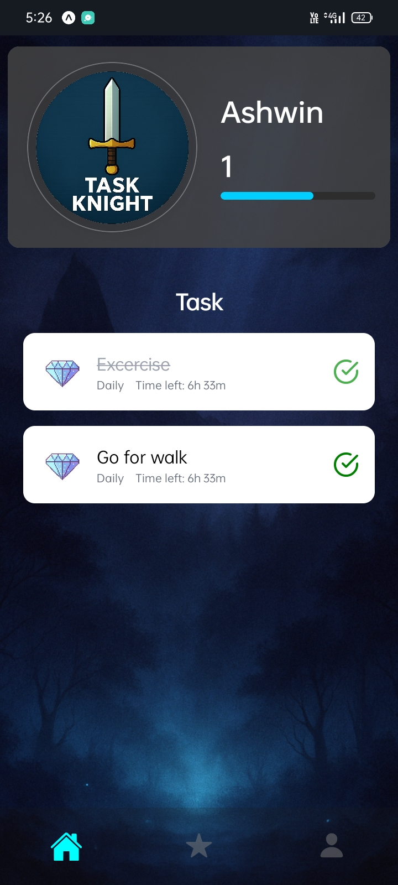
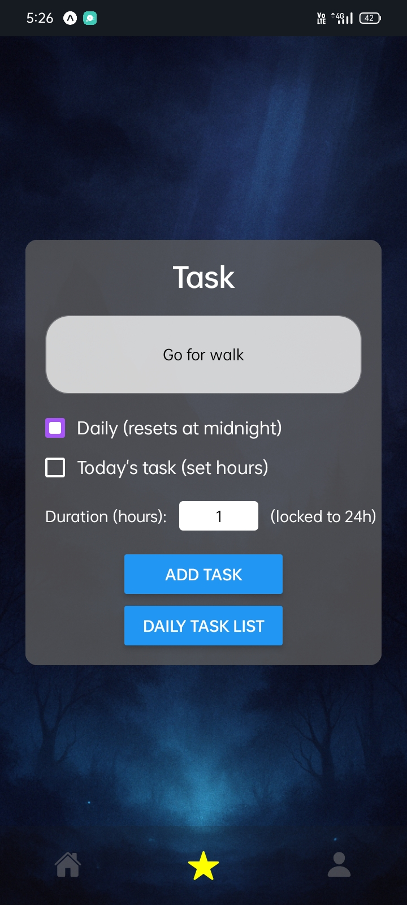
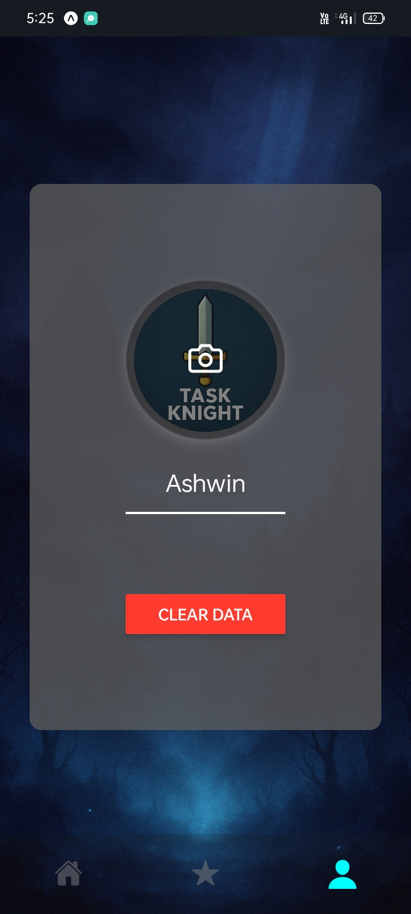

# ⚔️ Task Knight

> A gamified task management system that turns your daily productivity into an RPG-style experience.

---

## 🚀 Overview

**Task Knight** is a productivity application designed to make task management engaging and rewarding. Instead of traditional to-do lists, users complete tasks like a knight completing quests — gaining progress, building discipline, and staying consistent.

---

## ✨ Features

- 📝 **Task Management**
  - Add, update, and delete tasks
  - Organize tasks efficiently

- 🎮 **Gamification**
  - Complete tasks to gain progress/XP
  - Turn productivity into a game-like experience

- 📊 **Progress Tracking**
  - Visual representation of completed tasks
  - Track consistency and growth

- 👤 **User Experience**
  - Simple and clean UI
  - Beginner-friendly interface

---

## 🛠️ Tech Stack

- **Frontend:** (Add your stack — e.g., React / HTML / CSS)
- **Backend:** (Node.js / Python / etc.)
- **Database:** (MongoDB / Firebase / etc.)
- **Tools:** (Add any additional tools)


---

## ⚙️ Installation & Setup

```bash
# Clone the repository
git clone https://github.com/Ashwin-Pillai-22/Task-Knight.git

# Navigate into the project
cd Task-Knight

# Install dependencies
npm install

# Run the project
npx expo start
```
📱 Run on Mobile
1. Install the Expo Go app on your phone
2. Connect your phone and computer to the same network
3. Run the project using:
```bash
npx expo start
```
4. Scan the QR code shown in the terminal or browser using Expo Go

Your app will open instantly on your device 🚀

---

## 🎯 Usage
1. Add your daily tasks
2. Complete tasks like quests
3. Track your progress
4. Stay consistent and improve productivity

---

## 📸 Screenshots
<div style="display: flex; justify-content: space-between;">
  
  
  
</div>


---

## 🤝 Contributing

Contributions are welcome!
```bash
# Fork the repository
# Create a new branch
git checkout -b feature-name

# Commit your changes
git commit -m "Add feature"

# Push to your branch
git push origin feature-name
```

---

## 📌 Future Improvements
- 🔐 User authentication
- 🏆 Achievement system
-📱 Mobile responsiveness
- ☁️ Cloud sync
  
---

## 📬 Contact

Ashwin Pillai
- GitHub: https://github.com/Ashwin-Pillai-22
- LinkedIn: https://www.linkedin.com/in/ashwin-pillai-hello-world/

---

## ⭐ Support

If you like this project, give it a ⭐ on GitHub!


